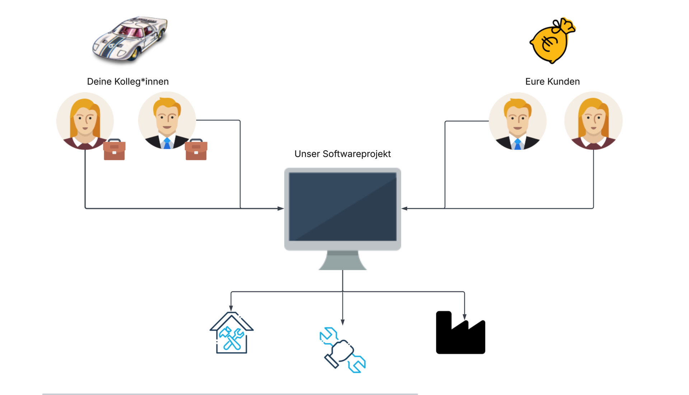

# Aufgabe
## Softwaresystem für einen Sportwagenhersteller

Ihr seid ein Sportwagenhersteller - spezialisiert auf Spezialanfertigungen - und erfüllt euren Kunden jeden Wunsch.




_Hierbei gibt es ein Problem:_\
Jeder Hersteller und **jede Werkstatt speichert ihre Daten und Angebote auf andere Art und Weise** und eure Kolleg*innen verschwenden jeden Tag wertvolle Zeit damit sich durch Dokumentationen zu kämpfen.

Deshalb möchtet ihr ein **Verwaltungssystem für eure Firma** entwickeln, welches für eure Hauptanbieter von Teilen spezifische Beschreibungslisten verwaltet und euren Kolleg*innen in einem übersichtlichen Format zur Verfügung stellt. Dabei gibt es folgende Anforderungen:
- Das System kümmert sich selbstständig um das **korrekte Einlesen aller Daten** aus den Angebotslisten der Hersteller. Diese liegen in verschiedenen Formaten vor (JSON, TXT, CSV, …). Eine Darstellung könnte wie folgt aussehen:

```
{
    name: "Carbon Heckflügel RS-3",
    serial_number: "QA-2025-00123",
    producer: "Brembo Pro",
    model_nummer: "BREM-F1234",
    production_date: "2025-01-04"
    description: "A spoiler typically used for racing cars",
    type: "SPOILER",
    number: 7,
    arrival_time: "2025-06-27",
    condition: "USED",
    price: 324.89 ,
    currency: "EUR",
    authorised: true,
    compatibleWith: [
        "BMV",
        "WV"
        "Nord",
        "Feramborghini",
        "Mecentley"
    ],
    modified_at: "2025-06-26T14:45:00Z"
}
```

- Das System bietet eine Schnittstelle für eure Kolleg*innen (Ausgabedatei, REST, …), welche in einem vereinbarten Format die wichtigsten Informationen zur Verfügung stellt (Lieferdatum, Anzahl, Preis, etc.). Das Format bestimmt ihr in Abstimmung mit allen Gruppen.
- Das System bietet eine Möglichkeit den Gesamtpreis eines eurer gelisteten Fahrzeuge basierend auf den Daten zu aktualisieren (Verfügbarkeit, Preis, etc.) und dem Kunden Informationen zu bieten, aufgrund dessen er eine Kaufentscheidung treffen könnte. Auch hier werden die notwendigen Daten von euch bestimmt und ein Ausgabeformat vereinbart.

Zur Einfachheit verwenden wir eine vorgefertigte Liste von Fahrzeugteilen und gelisteten Fahrzeuge, die ihr in eurem Gruppenordner findet.

## Randbedingungen

- Habt Spaß und lasst eurer Kreativität freien Lauf!
- Die Nutzung von KI ist erlaubt
- Einigt euch auf eine Programmiersprache eurer Wahl. ( Python ist empfehlenswert )

# Struktur/Architektur
Wir schlagen vor, das System in zwei Komponenten zu unterteilen.


- Die erste Komponente verwaltet die Daten und kümmert sich um das Einlesen und Aktualisieren der Teile- und Verkaufslisten. Sie kennt und speichert alle Informationen, die für die Berechnung von Fahrzeug- und Bauteil-Informationen benötigt werden. Sie bietet Schnittstellen für deine Kolleg*innen und Kunden um sich über die Produkte zu informieren.
- Die zweite Komponente ist für die Kommunikation mit Benutzer*innen zuständig. Je nach Nutzer werden hier ganze Fahrzeuge oder einfache Teile angezeigt. (Aufgrund der Zeit empfiehlt es sich erst eine Ansicht zu bauen und anschließend die zweite Ansicht darauf aufbauend anzulegen). Diese Komponente speichert die Informationen über die Teile und Fahrzeuge nicht selbst oder aktualisiert zumindest regelmäßig, da diese sich ändern können.

# Aufgaben
## Alle
- Welche Daten werden benötigt? Wie unterscheiden sich die Erwartungen zwischen deinen Kunden und deinen Kolleg*innen? Wie wollt ihr die Informationen weitergeben?
- Besprecht die Schnittstellen zwischen den Komponenten!
  - Welchen Zweck hat jede Schnittstelle?
  - Welche Daten müssen ausgetauscht werden, um diesen Zweck zu erfüllen?
  - Wer ruft wen auf? (Tipp: Woher weiß die Benutzer-Schnittstelle, welche Teile oder Fahrzeuge es überhaupt gibt?)
- Vervollständigt das obige Bild.
- Findet bessere Namen für die Komponenten. slightly smiling face

## Komponente 1
- Die Teile- und Fahrzeugdaten müssen gespeichert werden. Im ersten Schritt reicht eine Liste im Speicher. Euer Service muss sie auf verschiedene Arten suchen können - welche?
- Schaut euch die verschiedenen Teilelisten an und achtet hierbei auf die Notwendigkeit für eure Schnittstellen. Entscheidet auch wie ihr mit fehlerhaften oder unzureichenden Daten umgehen wollt.
- Implementiert Mapper für die Teilelisten und überführt die gegebenen Daten in benötigte Formate.
- Zusatzaufgaben:
  - Implementiert einen Aktualisierung-Algorithmus, der unter den verschiedenen Anbieterlisten doppelte Beschreibungen auflöst und nur die aktuellere Version persistiert. Hierbei können fehlende Daten aus alten Datenbeständen beibehalten werden.
  - Bietet zusätzliche Möglichkeiten an, nach Fahrzeugteilen zu suchen. Sprecht euch dazu mit dem benachbarten Team ab
    (, sofern dieses auch bereits fertig ist).
  - Speichert die Daten in einem Backup, damit sie nach einem Neustart des Systems wieder verfügbar sind. Wählt dazu eine Speichertechnik aus und implementiert das Speichern und Laden der Daten.

## Komponente 2
- Überlegt euch, welche Daten die beiden Nutzergruppen vermutlich sehen möchten und wie ihr sie darstellen/ausgeben wollt.
- Welche Daten braucht ihr für den Aufruf der Schnittstelle von Komponente 1?
- Implementiert die Benutzerschnittstelle für Kunden.
- Implementiert die Benutzerschnittstelle für eure Kolleg*innen der Sportwagenfirma.
- Zusatzaufgaben:
  - Überlegt zusammen mit dem anderen Team, wie eure Nutzer sonst noch nach Sendungen suchen können.
  - Implementiert diese Suchen.
  - Ermöglicht ein Zusammenstellen von Teilen für Kunden (Lieferungsdatum aller Teile, Preis aller Teile, etc.)
  - Welche Nutzer dürfen welche Funktion aufrufen? Entwerft eine Liste von Rollen und zugehörigen Rechten.
  - Implementiert eine einfache Nutzerverwaltung.